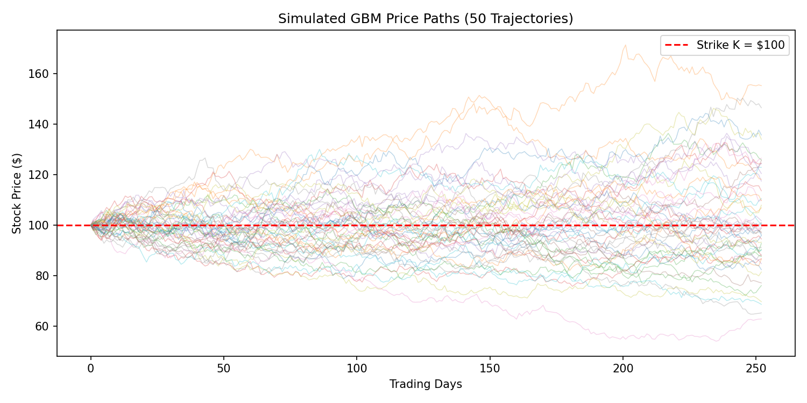
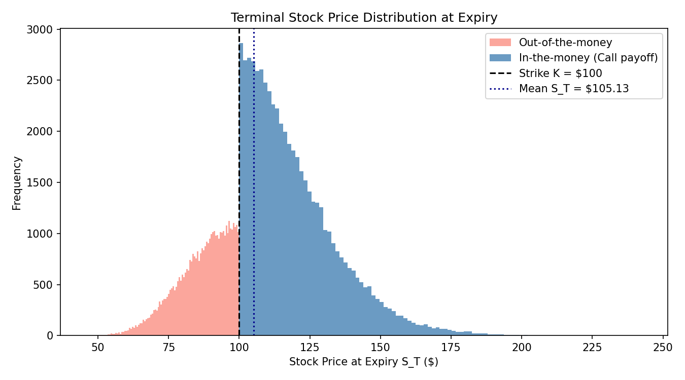
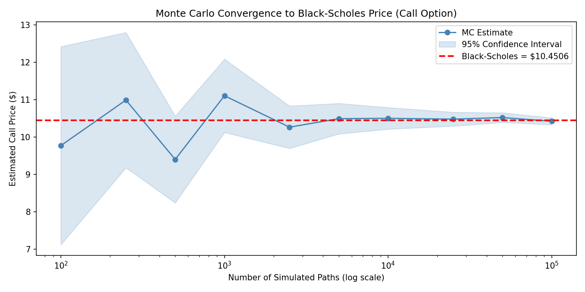
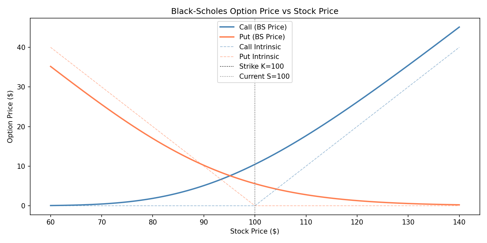
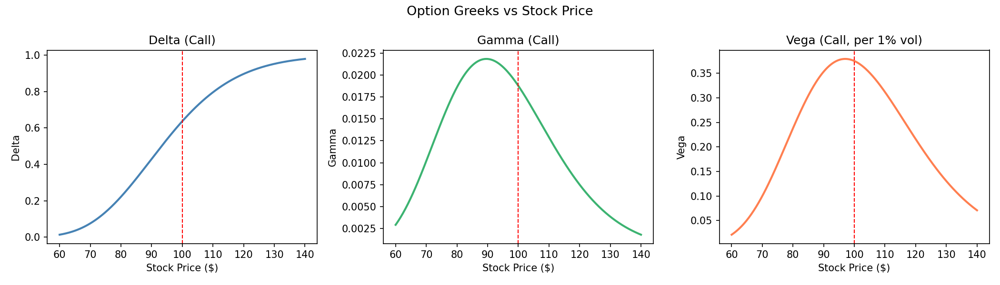
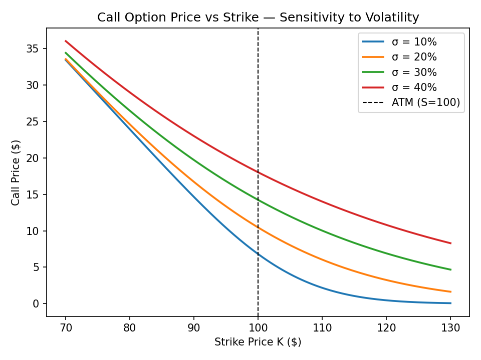

# Option Pricing: Black-Scholes & Monte Carlo Simulation

A Python implementation of European option pricing using both the **Black-Scholes analytical formula** and **Monte Carlo simulation** via Geometric Brownian Motion. Results are cross-validated and convergence behaviour is analysed across simulation sizes from 100 to 100,000 paths.

---

## Project Structure

```
optionpricing/
├── main.py
├── README.md
└── output_plots/
    ├── 1_gbm_price_paths.png
    ├── 2_terminal_distribution.png
    ├── 3_convergence_plot.png
    ├── 4_price_vs_spot.png
    ├── 5_greeks.png
    └── 6_volatility_sensitivity.png
```

---

## The Black-Scholes Model

The Black-Scholes formula prices a European option under the assumption that the underlying follows Geometric Brownian Motion under the risk-neutral measure:

$$C = S \cdot N(d_1) - K e^{-rT} \cdot N(d_2)$$
$$P = K e^{-rT} \cdot N(-d_2) - S \cdot N(-d_1)$$

where:

$$d_1 = \frac{\ln(S/K) + (r + \frac{1}{2}\sigma^2)T}{\sigma\sqrt{T}}, \qquad d_2 = d_1 - \sigma\sqrt{T}$$

## Monte Carlo Simulation

Under the risk-neutral measure, the terminal stock price is:

$$S_T = S_0 \cdot \exp\!\left[\left(r - \tfrac{1}{2}\sigma^2\right)T + \sigma\sqrt{T}\, Z\right], \quad Z \sim \mathcal{N}(0,1)$$

The option price is estimated as the discounted expected payoff:

$$\hat{C} = e^{-rT} \cdot \frac{1}{N} \sum_{i=1}^{N} \max(S_T^{(i)} - K,\ 0)$$

---

## Parameters

| Parameter | Value |
|---|---|
| Stock Price `S₀` | $100 |
| Strike Price `K` | $100 (at-the-money) |
| Time to Expiry `T` | 1 year |
| Risk-free Rate `r` | 5% |
| Volatility `σ` | 20% |

---

## Results

### Analytical Black-Scholes Prices

| | Value |
|---|---|
| d₁ | 0.3500 |
| d₂ | 0.1500 |
| **Call Price** | **$10.4506** |
| **Put Price** | **$5.5735** |

**Put-Call Parity Verification:**
```
C - P  =  4.8771
S - Ke^(-rT)  =  4.8771
```

### Option Greeks (Call)

| Greek | Value | Interpretation |
|---|---|---|
| Delta | 0.636831 | +$0.637 per $1 move in S |
| Gamma | 0.018762 | Rate of change of Delta |
| Vega | 0.375240 | +$0.375 per 1% increase in σ |
| Theta | −0.017573 | −$0.018 per day (time decay) |
| Rho | 0.532325 | +$0.532 per 1% increase in r |

### Monte Carlo Results (n = 100,000 paths)

| | MC Estimate | Black-Scholes | Error |
|---|---|---|---|
| Call | $10.4277 ± $0.0905 | $10.4506 | $0.0228 (0.219%) |
| Put | $5.6370 ± $0.0540 | $5.5735 | - |

The Monte Carlo estimate converges to within **0.22%** of the analytical Black-Scholes price at 100,000 paths.

---

## Output Plots

### Simulated GBM Price Paths (50 Trajectories)


### Terminal Stock Price Distribution at Expiry


*The lognormal terminal distribution split at the strike price (K=$100). The blue region represents in-the-money outcomes that generate a call payoff; the red region expires worthless. Mean S_T = $105.13, reflecting the 5% risk-free drift.*

### Monte Carlo Convergence to Black-Scholes Price


*At n=100 paths, the MC estimate fluctuates widely. By n=10,000 the 95% confidence interval tightens around the BS price of $10.4506, and at n=100,000 the estimate is within $0.023 - demonstrating the Law of Large Numbers in action.*

### Black-Scholes Option Price vs Stock Price


*Call and put prices shown alongside intrinsic value (dashed). The gap between the BS price and intrinsic value is the time value of the option.*

### Option Greeks vs Stock Price


*Delta transitions from 0 to 1 as the stock moves deep in-the-money. Gamma and Vega both peak at-the-money (K=$100), where the option is most sensitive to changes in spot price and volatility.*

### Call Price Sensitivity to Volatility


*Higher volatility increases option value across all strikes - vega is always positive for long options. The spread between volatility curves widens at-the-money where vega is largest.*

---

## Setup & Usage

**Install dependencies:**
```bash
pip install numpy matplotlib scipy
```

**Run the simulation:**
```bash
python main.py
```

All 6 plots are saved to `output_plots/`. Analytical results and Monte Carlo statistics are printed to the terminal.

---

## Key Concepts Demonstrated

- **Black-Scholes PDE** - closed-form pricing of European calls and puts using stochastic calculus
- **Geometric Brownian Motion** - risk-neutral simulation of continuous stock price paths
- **Risk-neutral pricing** - discounted expected payoff under the Q-measure
- **Monte Carlo estimation** - law of large numbers applied to option pricing
- **Convergence analysis** - variance reduction as n increases; standard error ∝ 1/√n
- **Put-Call Parity** - analytical validation: C − P = S − Ke^(−rT) 
- **Option Greeks** - Delta, Gamma, Vega, Theta, Rho sensitivity measures
- **Volatility sensitivity** - option price behaviour across σ = 10%, 20%, 30%, 40%

---

## Technologies

- Python 3
- NumPy
- SciPy (`scipy.stats.norm`)
- Matplotlib
